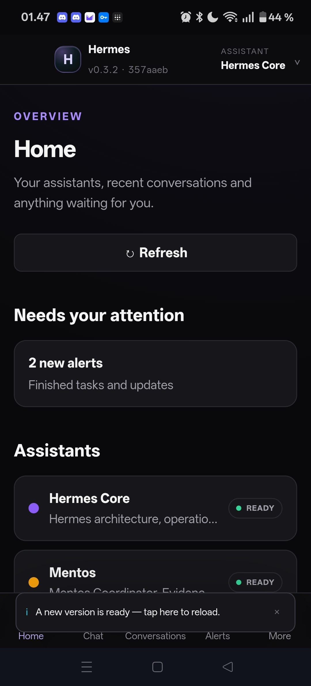
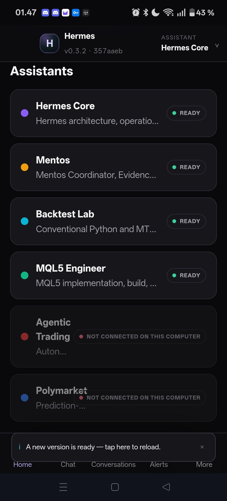
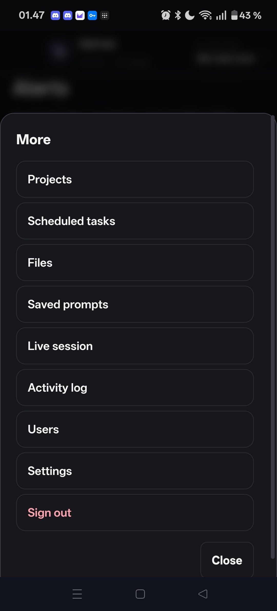

# Hermes Companion

**Your Hermes assistants, on your phone. Keys stay on your computer.**

Hermes Companion is a small app you run next to [Hermes Agent](https://hermes-agent.nousresearch.com). It gives you a private website (and home-screen app) for chat, approvals, conversations and scheduled tasks — the same profiles you already use on the desktop.

The browser never sees a Hermes API key. A local FastAPI bridge on `127.0.0.1:8787` holds the secrets and talks to Hermes on the loopback interface.

> Not affiliated with Nous Research. Companion talks to the Hermes Agent you already installed.

[Install](#install-windows) · [Phone](#phone) · [How it works](#how-it-works) · [Docs](#docs) · [Security](#security)

<p align="center">
  
  
  
</p>

---

## Install (Windows)

You need **Hermes Agent** (`hermes profile list` works) and **Python 3.11+**.

```powershell
git clone https://github.com/NikaQuant/hermes-companion.git C:\HermesCompanion
cd C:\HermesCompanion
.\install.cmd
```

Type an email and a password when asked (12+ characters). They are stored only on this computer.

Open http://127.0.0.1:8787 and sign in.

Full walkthrough: [`INSTALL.md`](INSTALL.md).  
If an AI is doing the install, give it [`docs/AGENT_INSTALL_GUIDE.md`](docs/AGENT_INSTALL_GUIDE.md).

Linux/macOS: the bridge is plain Python (`pip install -e ./services/bridge` then `uvicorn`). The one-click installer is Windows-first today.

## Phone

The service listens on loopback only. Put Tailscale (or any private HTTPS) in front of port **8787** — never Hermes ports 8642 / 9119.

```powershell
tailscale serve --bg 8787
.\scripts\set-public-url.ps1 -Url https://<your-machine>.<tailnet>.ts.net
.\scripts\reload-bridge.ps1
```

On the phone: Tailscale **Connected** → open that `https://…ts.net` address → Add to Home Screen.

Details: [`docs/PHONE_ACCESS.md`](docs/PHONE_ACCESS.md).

## How it works

```text
Phone / browser  --HTTPS-->  Companion bridge :8787  --loopback-->  Hermes :8642
                                  |                                      |
                           your login, ACL,                      your profiles,
                           files, passkeys                       sessions, tools
```

Profiles are discovered from `hermes profile list` at install time. Nothing is hard-coded to anyone else's agents.

## Docs

| File | For |
|---|---|
| [`INSTALL.md`](INSTALL.md) | Human, 5 minutes |
| [`docs/AGENT_INSTALL_GUIDE.md`](docs/AGENT_INSTALL_GUIDE.md) | An AI doing the install — commands, expected output, failure table |
| [`docs/PHONE_ACCESS.md`](docs/PHONE_ACCESS.md) | Tailscale + PWA |
| [`docs/ARCHITECTURE.md`](docs/ARCHITECTURE.md) | How the bridge is put together |
| [`docs/SECURITY.md`](docs/SECURITY.md) / [`docs/THREAT_MODEL.md`](docs/THREAT_MODEL.md) | What is and isn't promised |
| [`docs/API_REFERENCE.md`](docs/API_REFERENCE.md) | Bridge HTTP API |
| [`CHANGELOG.md`](CHANGELOG.md) | What changed |
| [`docs/README.md`](docs/README.md) | Full index |

## Security

- Hermes keys never leave the bridge host.
- Passwords are scrypt-hashed; sessions are opaque rotating tokens per device.
- Safety World / Live Safe / Live Judge profile names are refused.
- Passkeys (WebAuthn) work once `PUBLIC_APP_URL` is your HTTPS hostname.
- Optional Windows Defender scan on uploads.

See [`SECURITY.md`](SECURITY.md) to report a vulnerability.

## Development

```powershell
python -m venv .venv
.\.venv\Scripts\pip install -e .\services\bridge[dev]
copy config\profiles.example.json config\profiles.json
.\.venv\Scripts\python.exe -m pytest services\bridge -q
.\.venv\Scripts\python.exe scripts\build-web.py
```

UI tests (phone viewport, against a running bridge):

```powershell
.\.venv\Scripts\python.exe -m pytest apps\web\tests -q --browser chromium
```

Please read [`CONTRIBUTING.md`](CONTRIBUTING.md).

## License

[MIT](LICENSE) © Nik Andersen
